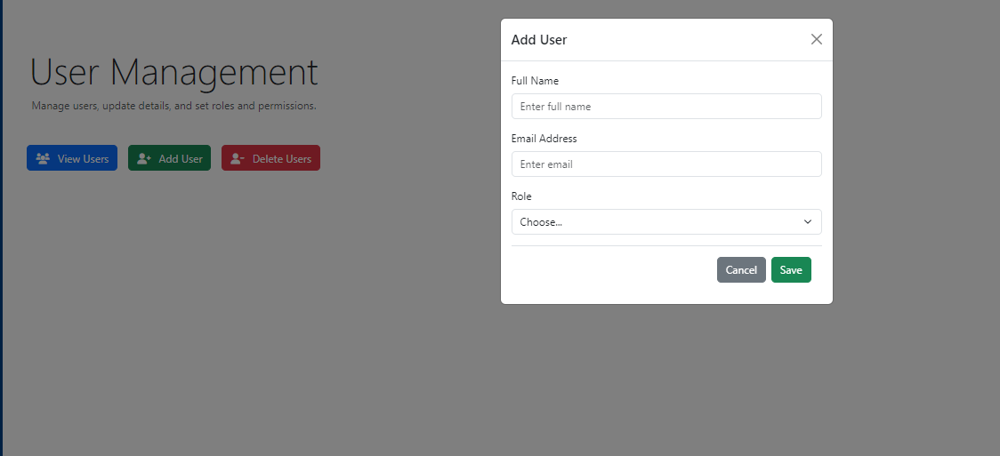

# Abnormal Vehicle Permit System (AVP)

## Overview
The **Abnormal Vehicle Permit System (AVP)** is a web-based application designed to facilitate the management of permits for abnormal load vehicles. The system supports various modules, including permit creation, user management, data management, and reporting.

---

## Features

1. **Dashboard**
   - Displays an overview of permit activities.
   - Provides quick actions and recent activities.

2. **Permit Management**
   - Create new permits by entering detailed owner, vehicle, and load information.
   - Edit or amend existing permits.

3. **Reports**
   - Generate monthly and ad hoc reports.

4. **User Management**
   - Manage users, update details, and set roles and permissions.

5. **Data Management**
   - Backup and restore the system database.

6. **Settings**
   - Update user profile and preferences.

7. **Payment**
   - Simulate payments using various methods, including credit/debit cards, bank transfer, mobile wallets, Apple Pay, and Google Pay.

8. **Help & Support**
   - Access tutorials, manuals, and video guides on using the system effectively.

---

## Screenshots

### Dashboard


### Help & Support


### Payment Methods


### Payment Success


### Settings


### Data Management


### User Management


#### Add User


#### Delete User


### Reports

#### Ad Hoc Reports


#### Monthly Reports


### Permit Management

#### Create New Permit - Owner/Account Details


#### Create New Permit - Vehicle/Load Details


#### Create New Permit - Permit Details


#### Edit/Amend Permit


---

## Installation

1. Clone the repository:
   ```bash
   git clone https://github.com/yourusername/abnormal_loads_project.git
   ```

2. Navigate to the project directory:
   ```bash
   cd abnormal_loads_project
   ```

3. Create a virtual environment and activate it:
   ```bash
   python -m venv env
   source env/bin/activate  # On Windows use `env\Scripts\activate`
   ```

4. Install dependencies:
   ```bash
   pip install -r requirements.txt
   ```

5. Run migrations:
   ```bash
   python manage.py migrate
   ```

6. Start the development server:
   ```bash
   python manage.py runserver
   ```

7. Access the application at `http://127.0.0.1:8000`.

---

## Usage

- **Login**: Access the system using your credentials.
- **Navigate**: Use the sidebar menu to navigate between different modules.
- **Generate Reports**: Go to the `Reports` section to generate monthly or ad hoc reports.
- **Manage Users**: Go to the `User Management` section to view, add, or delete users.
- **Create Permits**: Use the `Permit Management` section to create new permits or edit existing ones.
- **Simulate Payments**: Use the `Payment` section to simulate payments using different methods.

---

## Contributing

Contributions are welcome! Please follow these steps:

1. Fork the repository.
2. Create a new branch for your feature or bug fix.
3. Commit your changes and push to your fork.
4. Create a pull request.

---

## License

This project is licensed under the MIT License. See the `LICENSE` file for details.

---

## Contact

For any inquiries or support, please contact:
- **Hlulani Trevor Nkuna**
- Email: [hnkuna@csir.co.za](mailto:hnkuna@csir.co.za)
